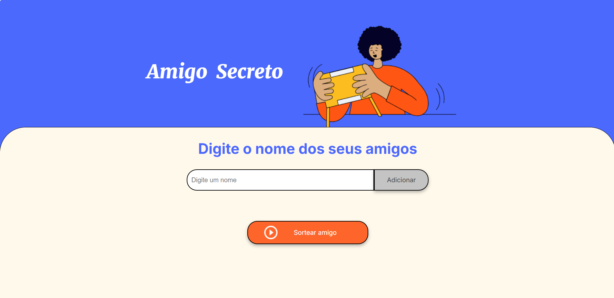
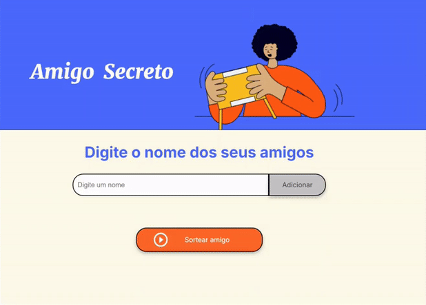

# 🎉 **Amigo Secreto - Sorteio de Amigo Secreto Online!** 🎉

Bem-vindo ao projeto **Amigo Secreto**! Esse aplicativo foi desenvolvido para tornar o sorteio de amigo secreto ainda mais divertido e interativo. 😄✨

A ideia é simples: adicione os nomes dos amigos, sorteie aleatoriamente um nome e veja o resultado com animações e confetes! 💥

---

## 🚀 **Funcionalidades**

- **Adicionar Nomes**: Insira os nomes dos seus amigos na lista de sorteio.
- **Sortear Amigo Secreto**: Sorteie um nome aleatoriamente entre os amigos adicionados.
- **Animações**: Durante o sorteio, confetes caem da tela, e animações de tremor trazem um toque especial! ✨🎉

---

## 🧑‍💻 **Tecnologias Utilizadas**

Aqui estão as tecnologias usadas para criar esse projeto:

| Tecnologia  | Descrição                                      |
|-------------|------------------------------------------------|
| **HTML**    | Estrutura básica do projeto.                  |
| **CSS**     | Estilos e animações para deixar o projeto bonito. |
| **JavaScript** | Lógica de sorteio e animações interativas.    |

---

# 📱 **Visualização do Projeto**

Veja como a página do "Amigo Secreto" fica quando você clica para sortear o amigo! Confetes caem, o título pisca e a imagem treme! 😄🎉



Confira o resultado em ação no gif abaixo:



---

## 📱 Responsividade

Este projeto foi desenvolvido com design responsivo, garantindo uma experiência de usuário otimizada em diferentes tamanhos de tela.

### 🖥️ Visualização por Dispositivo
Abaixo está um resumo de como o layout se adapta a diferentes tamanhos de tela:

| Tamanho de Tela          | Ajustes de Layout                                                                 |
|--------------------------|-----------------------------------------------------------------------------------|
| **Desktop (largo)**      | 🖥️ **Layout otimizado** para grandes telas, com elementos bem distribuídos.          |
| **Tablet (máximo 768px)**| 📱 **Ajuste de título**: O título diminui para 36px. O banner se reorganiza em uma coluna, com entradas ajustadas para facilitar o uso. |
| **Smartphone (máximo 480px)**| 📲 **Compactação de elementos**: O título reduz para 24px. Elementos e botões se compactam para melhor interação. |

### 🔍 Como Testar a Responsividade
1. 🔍 Abra o projeto em seu navegador.
2. ⚙️ Utilize a ferramenta de **inspeção** (F12) e ative o **modo responsivo**.
3. 📱 Teste diferentes tamanhos de tela para ver as adaptações.


---

## ⚙️ **Como Usar**

Siga os passos abaixo para começar a usar o Amigo Secreto:

1. **Clone o repositório**:
    ```bash
    git clone https://github.com/seu-usuario/amigo-secreto.git
    ```

2. **Abra o arquivo `index.html`** no seu navegador.

3. **Adicione nomes** no campo de entrada e clique no botão "Sortear amigo" para ver a magia acontecer! 🧙‍♂️✨

---


---

## 🏗️ **Estrutura do Projeto**

Aqui está a estrutura do seu projeto para você entender melhor como ele está organizado:

| Arquivo            | Descrição                                      |
|--------------------|------------------------------------------------|
| `index.html`       | O arquivo principal com a estrutura HTML.      |
| `style.css`        | Arquivo CSS com os estilos e animações.        |
| `app.js`           | Lógica JavaScript para o sorteio e animações.  |
| `assets/`          | Contém as imagens e GIFs usados no projeto.    |

---

## 🎨 **Personalizações**

Você pode personalizar o projeto de várias maneiras! Aqui estão algumas ideias:

- **Alterar as animações**: Modifique o estilo e a duração das animações no CSS.
- **Alterar o design**: Mude as cores e fontes para dar o seu toque pessoal.
- **Adicionar novas animações**: Use o JavaScript para criar novos efeitos ao sortear o amigo secreto.

---


---

## 💬 **Contribuindo**

Se você tiver sugestões ou quiser ajudar a melhorar o projeto, **contribua com um Pull Request**! 🧑‍💻✨

1. Faça um **fork** deste repositório.
2. Crie uma **branch** para a sua melhoria.
3. Envie um **Pull Request**.

---

## 🧑‍🏫 **Licença**

Este projeto é licenciado sob a **MIT License**. Veja o arquivo [LICENSE](LICENSE) para mais informações.

---

## 🏆 **Créditos**

Este projeto foi criado com muito carinho por [**Thais Moura**](https://github.com/thaistech).✨

---


---


## 🎉 **Divirta-se com o Amigo Secreto!**

Agora é sua vez! **Adicione seus amigos**, **faça o sorteio** e veja o que a mágica do "Amigo Secreto" pode fazer! 🎁✨

---

## **Gostou do projeto?** ⭐

Se você gostou do projeto, não se esqueça de **star** e **fork** para ajudar outros a descobrirem também! 🚀

